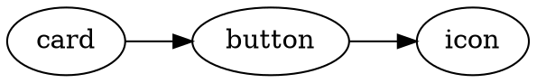

# Таски обработки компонентов

Этот документ описывает Gulp‑таски, связанные с компонентной архитектурой проекта: валидацией, зависимостями, документацией и вспомогательной автоматикой.

> Компонент — это изолированная сущность верстки (HTML + SCSS + JS + MD), расположенная в папке `components/<component-name>/`.

---

## Общая структура компонента

```
components/
└─ button/
   ├─ button.html        # HTML-разметка компонента
   ├─ button.scss        # SCSS-стили компонента
   ├─ button.js          # JS-логика компонента (опционально)
   └─ button.md          # Документация и декларация зависимостей
```

---

## Основные настройки (add.setings)

| Настройка | Тип | Описание |
|---------|----|---------|
| validateComponents | boolean | Глобальный флаг включения компонентных проверок |
| validateScssDeps | boolean | Проверка соответствия SCSS-зависимостей и `.md` |
| generateScssDepsGraph | boolean | Генерация графа SCSS-зависимостей в формате `.dot` |
| scssDepsGraphFile | string | Путь к файлу `.dot` относительно `add.paths.dest` |
| lazyInitMode | 1 \| 2 \| 3 | Режим lazy‑инициализации JS‑компонентов |

---

## validateScssDeps

**Назначение:**
Проверяет, что зависимости, используемые в `@use` внутри SCSS‑файла компонента, корректно описаны в `component.md`.

**Файл:**
```
gulp/tasks/validate-scss-deps.mjs
```

### Что делает

1. Проходит по всем компонентам в `add.paths.html.components`
2. Читает `<component>.scss`
3. Извлекает все `@use`
4. Оставляет только компонентные зависимости (папки‑компоненты)
5. Сравнивает их с зависимостями из `<component>.md`
6. Сообщает об ошибках и предупреждениях

### Проверки

#### ❌ Ошибка

```
✖ button.scss: @use "icon" не описан в button.md
```

Возникает если:
- компонент `icon` используется в SCSS
- но отсутствует в `button.md`

#### ⚠ Предупреждение

```
⚠ button: зависимость "icon" описана, но не подключена в SCSS
```

Возникает если:
- зависимость описана в `.md`
- но не используется в SCSS

### Что **НЕ** проверяется

- `base/*` SCSS‑модули (variables, mixins, reset)
- встроенные sass‑модули (`sass:math` и т.п.)

---

## extractScssUses

**Назначение:**
Парсер SCSS‑файла, извлекающий зависимости из `@use`.

**Пример:**
```scss
@use "../icon/icon";
@use "../../scss/base/variables";
```

Результат:
```
["icon", "variables"]
```

> Далее зависимости фильтруются: учитываются только реальные компоненты.

---

## extractDeps (component-md.mjs)

**Назначение:**
Извлекает декларативные зависимости из `.md`‑файла компонента.

**Пример button.md:**
```md
## Зависимости
- icon
- tooltip
```

Результат:
```
["icon", "tooltip"]
```

---

## Генерация графа SCSS‑зависимостей (.dot)

**Условие:**
```js
add.setings.generateScssDepsGraph === true
```

**Результат:**
Создаётся файл `.dot`, который можно визуализировать через Graphviz.

**Пример содержимого:**


**Использование:**
```
dot -Tsvg scss-deps.dot -o scss-deps.svg
```

---

## Валидация документации компонентов

Если файл `<component>.md` отсутствует:

- компонент считается **неописанным**
- в `components.json` будет записано:

```
button: нет описания
```

---

## Принципы архитектуры (важно)

- Base‑SCSS — инфраструктура, не зависимость
- Компонент документирует **только другие компоненты**
- `.md` — источник истины для архитектурных связей
- SCSS / JS — реализация

---

## Рекомендуемый SCSS‑стиль

```scss
@use "base/variables" as v;
@use "base/mixins" as m;
@use "../icon/icon";
```

---

## Итог

Эти таски позволяют:
- поддерживать чистую компонентную архитектуру
- выявлять скрытые зависимости
- документировать систему автоматически
- строить графы компонентов

Документ обязателен для всех участников команды.

